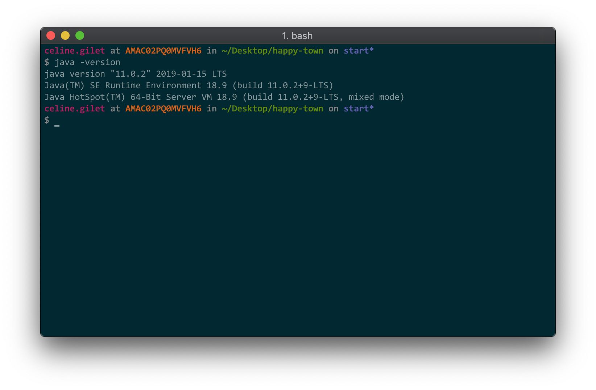
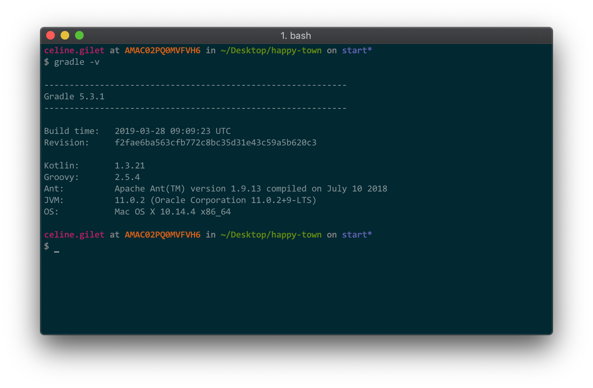
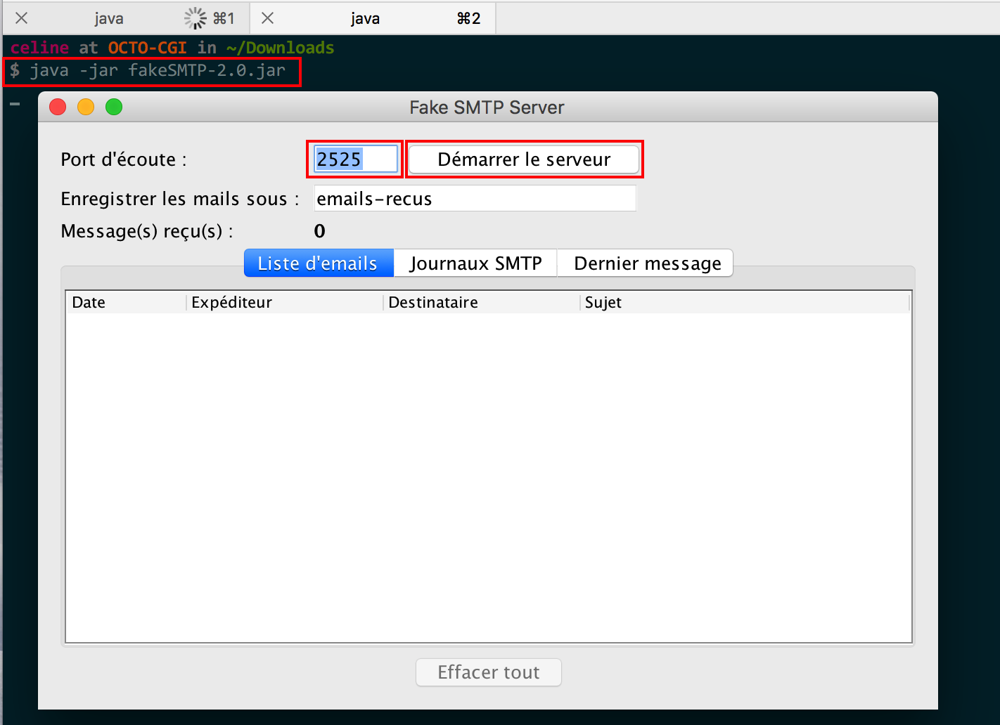
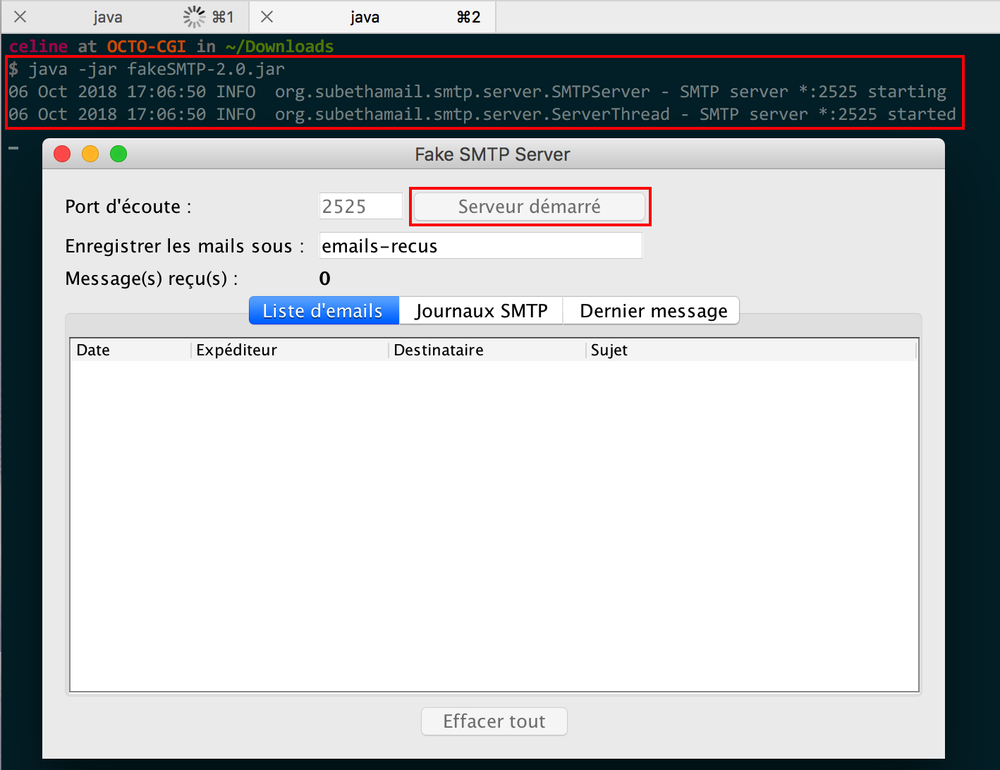
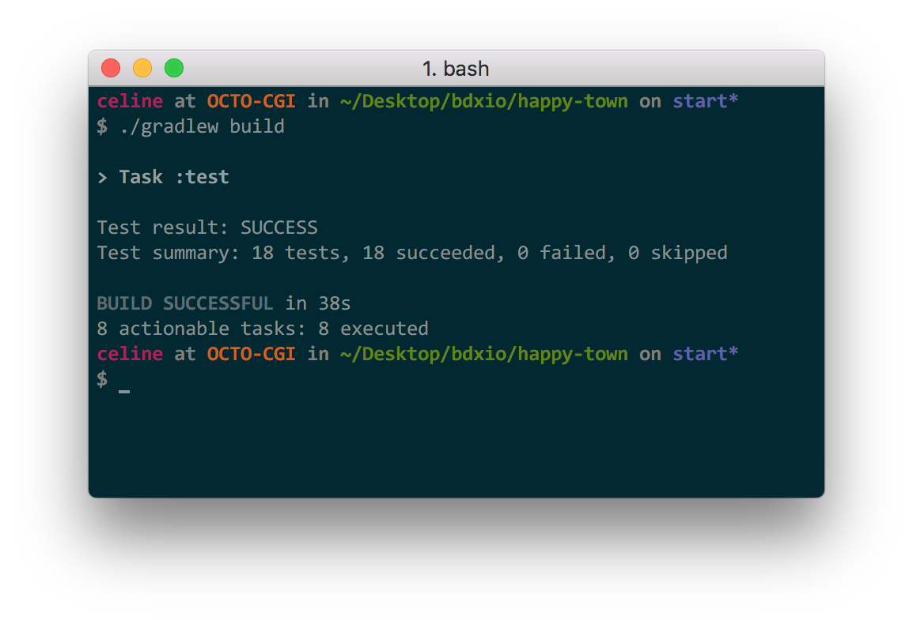
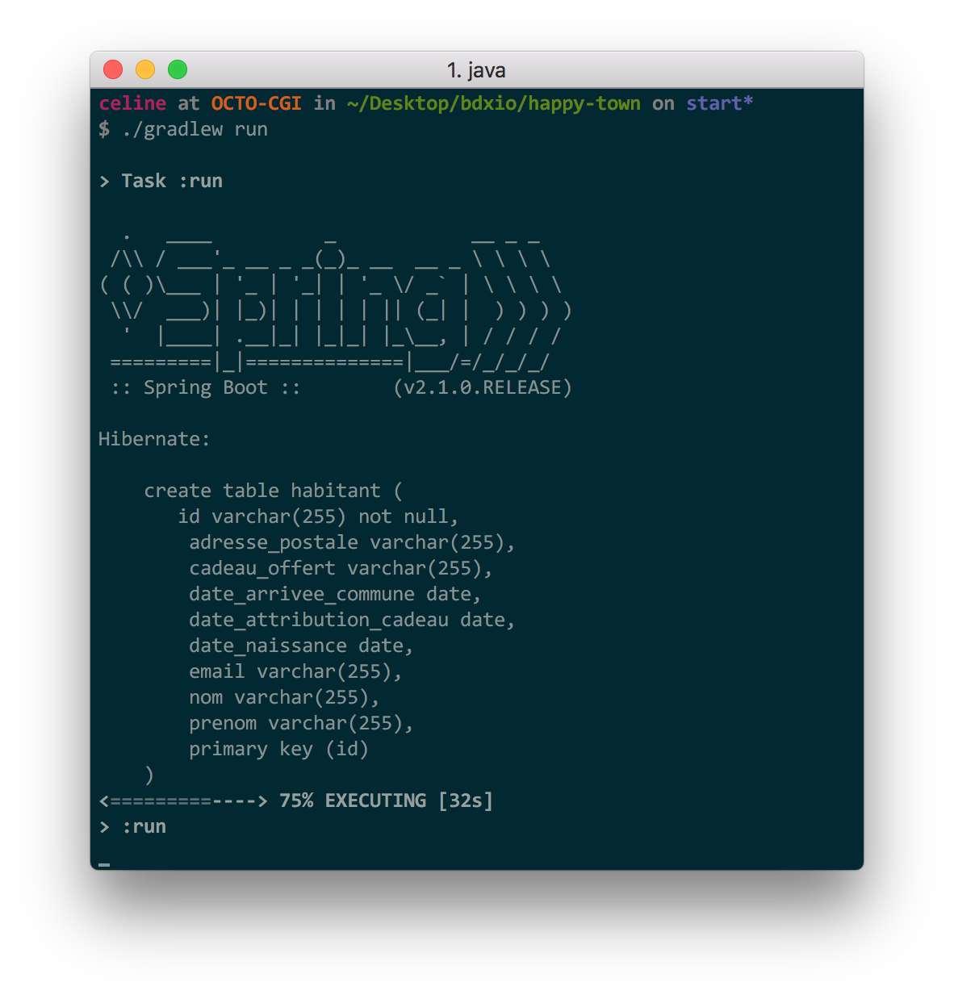
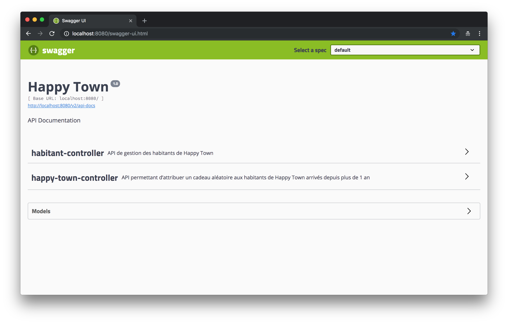
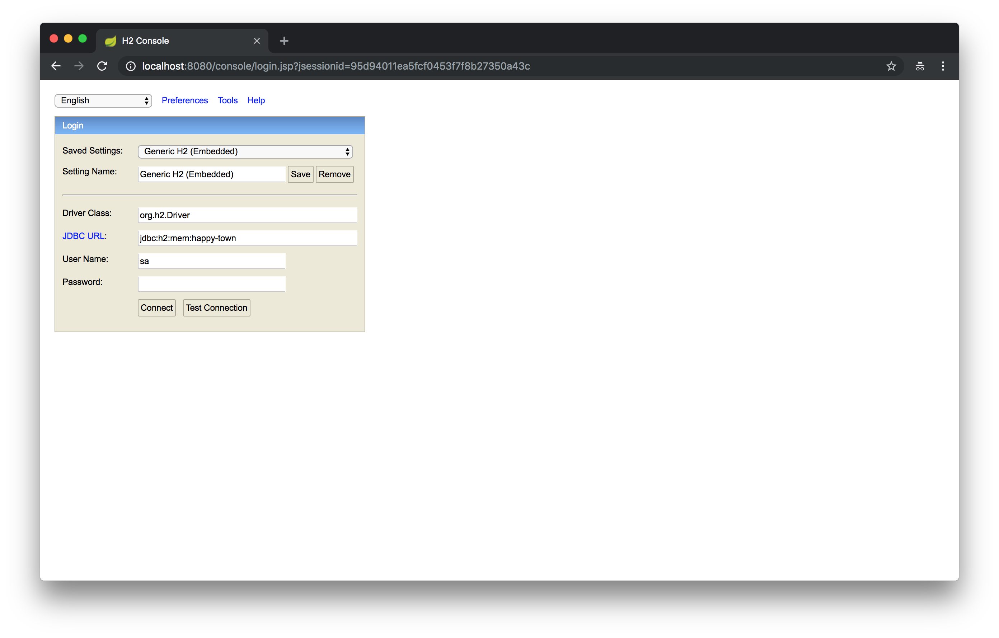
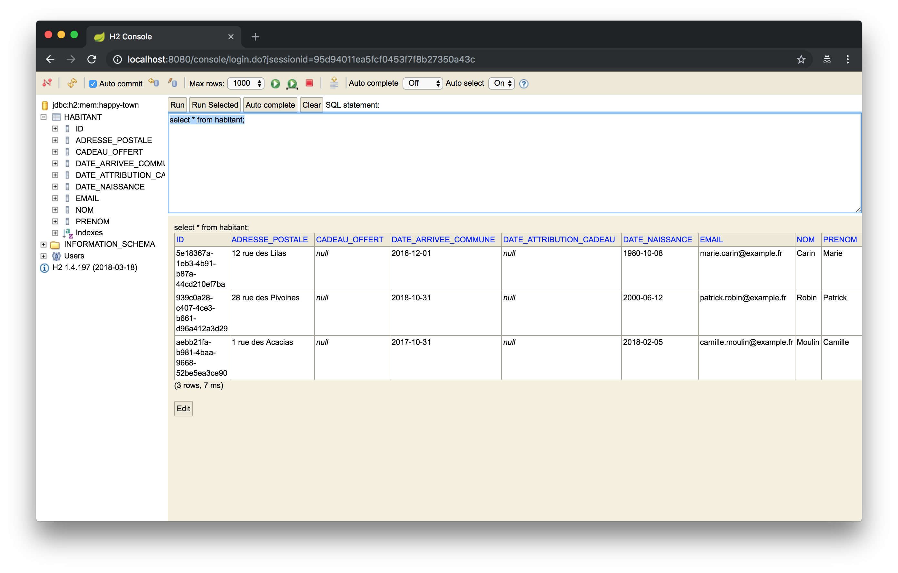

# Happy Town

## Présentation
Pour accueillir dignement ses nouveaux habitants, le conseil municipal de _HappyTown_ a décidé **d’offrir un cadeau à tous ses habitants qui soufflent leur première bougie dans la commune**.

Le rôle de notre application est donc :
 * De **sélectionner les habitants éligibles** à l’obtention d'un **cadeau** (ils ont emménagés à _HappyTown_ depuis **plus de 1 an**)
 * Pour chacun des habitants éligibles :
    * **Trouver le cadeau approprié** en fonction de son **âge** : il existe des cadeaux différents par **tranche d’âge**
    * **Envoyer un mail** annonçant l'attribution du cadeau
 * Envoyer un **mail récapitulatif** au service cadeau de la mairie avec **tous les cadeaux attribués de la journée**

## Installation

### Java
 * [Java 11](https://www.oracle.com/technetwork/java/javase/downloads/jdk11-downloads-5066655.html)
 * Recette __`java -version`__ 

### Gradle 
 * [Gradle](https://gradle.org/install/)
 * Recette __`gradle -v`__

### Serveur de mail
 * [FakeSMTP](http://nilhcem.com/FakeSMTP/download.html)
 * Lancement __`java -jar fakeSMTP-2.0.jar`__
    * Démarrage sur le port : **2525**

    * Recette

## Lancement de HappyTown
 * Pour installer les dépendances du projet, lancer dans un terminal __`./gradlew build`__

 * Pour lancer uniquement les tests, lancer dans un terminal __`./gradlew test`__

 * Pour démarrer l'application _HappyTown_ __`./gradlew run`__

## URLs
 * [API Happy Town](http://localhost:8080/swagger-ui.html)

 * [Base de données H2](http://localhost:8080/console)
    * Driver Class : **org.h2.Driver**
    * JDBC URL : **jdbc:h2:mem:happy-town**
    * User Name : sa
    * Password :

